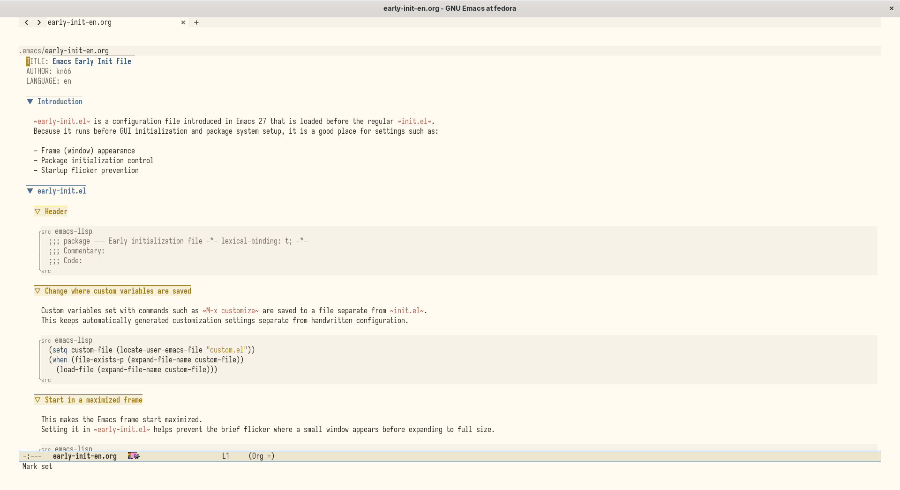
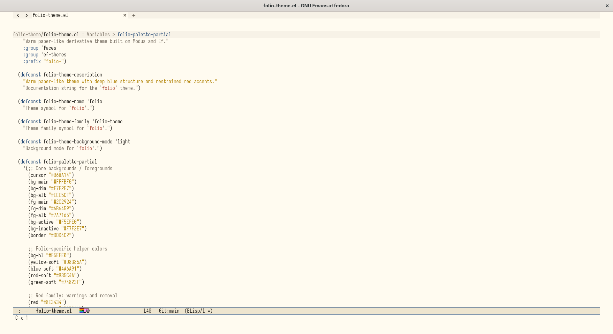
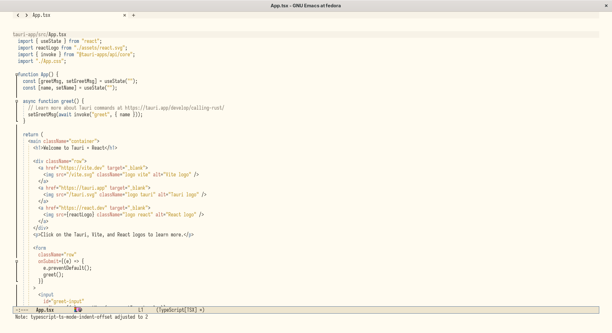

#+title: folio-theme

Language: *English* | [[./README.ja.org][日本語]]

Warm light Emacs theme with a paper-like off-white background, deep blue
structural accents, and restrained red highlights.

~folio-theme~ is now built as a derivative theme on top of
~modus-themes~ and ~ef-themes~.

- ~ef-themes~ provides the semantic palette vocabulary
- ~modus-themes~ applies that palette across a broad set of package faces
- ~folio~ keeps its own paper/blue/red identity through a custom partial
  palette and semantic mappings

* Acknowledgements

~folio-theme~ builds directly on the work of Protesilaos Stavrou, the author
of ~modus-themes~ and ~ef-themes~. Its derivative structure, semantic palette
vocabulary, and broad inherited face coverage depend on those projects.

* Screenshots
:PROPERTIES:
:ID:       a2661746-41fd-4795-bd73-25ebd5b2d316
:END:

** org-mode
:PROPERTIES:
:ID:       25dd3c85-5638-470d-b883-52164d4b0e32
:END:

#+DOWNLOADED: screenshot @ 2026-04-20 21:21:35

** emacs-lisp
:PROPERTIES:
:ID:       eac291ff-fb99-484d-8ebf-ffc41e8079e4
:END:

#+DOWNLOADED: screenshot @ 2026-04-20 21:13:11

** tsx
:PROPERTIES:
:ID:       95934e53-fb20-4c7e-89be-f0bcfec9cee1
:END:

#+DOWNLOADED: screenshot @ 2026-04-20 21:22:21

* Dependencies

- Emacs ~28.1+~
- ~modus-themes 5.0.0+~
- ~ef-themes 2.0.0+~

* Load locally

Install the dependencies, add the directory that contains
~folio-theme.el~ to ~custom-theme-load-path~, then load the theme:

#+begin_src emacs-lisp
(defconst folio-theme-directory "/path/to/folio-theme-directory")

(package-install 'modus-themes)
(package-install 'ef-themes)

(add-to-list 'custom-theme-load-path folio-theme-directory)
(load-theme 'folio t)
#+end_src

Reloading ~folio-theme.el~ in an active session is also supported.

* Install with use-package

~folio-theme~ now provides the ~folio-theme~ feature, so it can be loaded
directly via ~use-package~ before calling ~load-theme~:

When installed as a package, its directory is also registered in
~custom-theme-load-path~, so ~M-x load-theme~ and theme selection UIs can
discover ~folio~ normally.

#+begin_src emacs-lisp
(use-package folio-theme
  :vc (:url "https://github.com/kn66/folio-theme.el"
       :rev :newest)
  :config
  (load-theme 'folio t))
#+end_src

* Design direction

- Background: ~#FFFBF0~ inspired by Sakura Editor's light background
- Structure: deep blue
- Alerts and exceptions: restrained red
- Goal: stay usable for long sessions without the background feeling too
  yellow

* Implementation model

- ~folio-palette-partial~: base named colors for the theme
- ~folio-palette-mappings-partial~: semantic role mappings in the Ef style
  for UI, headings, marks, modelines, and terminal colors
- ~folio-custom-faces~: targeted package face overrides where inherited
  mappings are not sufficient on their own

The theme stays palette-first: blue carries structure, red carries
exceptions, and warm yellow stays in supporting surfaces.
Corfu uses a dedicated blue current-line surface so the selected candidate
remains visible without breaking the paper-like background.

* Validation

For package.el based setups, initialize packages before batch-loading the
theme:

#+begin_src sh
emacs --batch -L . --eval "(progn (require 'package) (package-initialize) (require 'folio-theme) (load-theme 'folio t))"
#+end_src

Byte compilation can be checked the same way:

#+begin_src sh
emacs --batch --eval "(progn (require 'package) (package-initialize) (byte-compile-file \"folio-theme.el\"))"
#+end_src

See [[./DESIGN.org][DESIGN.org]] for the English design document and
[[./DESIGN.ja.org][DESIGN.ja.org]] for the Japanese version.
