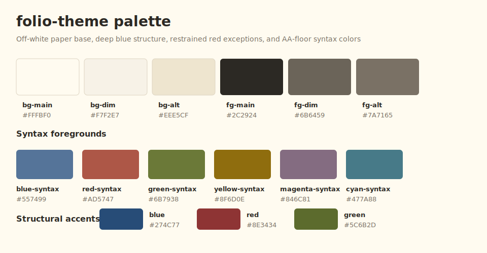
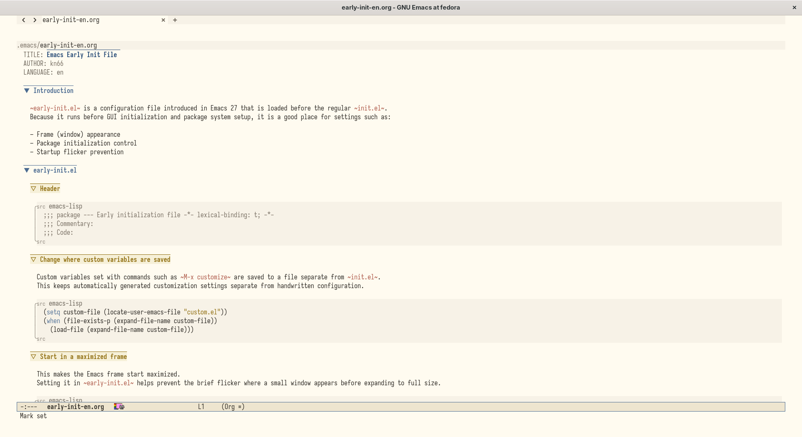
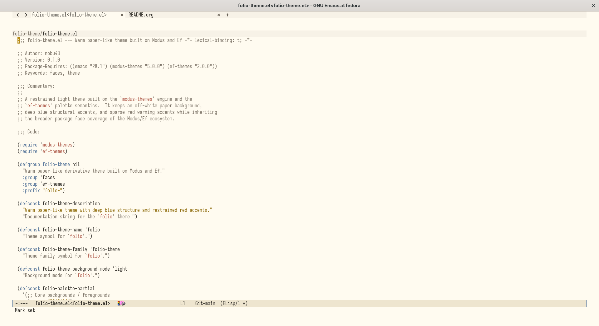
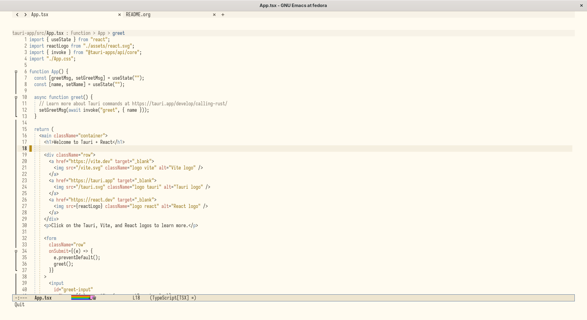

#+title: folio-theme

Language: *English* | [[./README.ja.org][日本語]]

Warm light Emacs theme with a paper-like off-white background, deep blue
structural accents, and restrained red highlights.

~folio-theme~ is now built as a derivative theme on top of
~modus-themes~ and ~ef-themes~.

- ~ef-themes~ provides the semantic palette vocabulary
- ~modus-themes~ applies that palette across a broad set of package faces
- ~folio~ keeps its own paper/blue/red identity through a custom partial
   palette and semantic mappings

* Acknowledgements

~folio-theme~ builds directly on the work of Protesilaos Stavrou, the author
of ~modus-themes~ and ~ef-themes~. Its derivative structure, semantic palette
vocabulary, and broad inherited face coverage depend on those projects.

* Screenshots
:PROPERTIES:
:ID:       a2661746-41fd-4795-bd73-25ebd5b2d316
:END:

** org-mode
:PROPERTIES:
:ID:       d8ddc1f2-0103-445e-9e46-414fa8dc93b3
:END:

#+DOWNLOADED: screenshot @ 2026-04-25 10:55:54

** emacs-lisp
:PROPERTIES:
:ID:       4c2576e4-d687-4b91-bc9f-3a035c313ec8
:END:

#+DOWNLOADED: screenshot @ 2026-04-25 10:56:23

** tsx
:PROPERTIES:
:ID:       314c6a2f-faab-4d30-8491-3cef94b9ac5e
:END:

#+DOWNLOADED: screenshot @ 2026-04-25 10:57:00

* Dependencies

- Emacs ~28.1+~
- ~modus-themes 5.0.0+~
- ~ef-themes 2.0.0+~

* Load locally

Install the dependencies, add the directory that contains
~folio-theme.el~ to ~custom-theme-load-path~, then load the theme:

#+begin_src emacs-lisp
  (defconst folio-theme-directory "/path/to/folio-theme-directory")

  (package-install 'modus-themes)
  (package-install 'ef-themes)

  (add-to-list 'custom-theme-load-path folio-theme-directory)
  (load-theme 'folio t)
#+end_src

Reloading ~folio-theme.el~ in an active session is also supported.

* Install with use-package

~folio-theme~ now provides the ~folio-theme~ feature, so it can be loaded
directly via ~use-package~ before calling ~load-theme~:

When installed as a package, its directory is also registered in
~custom-theme-load-path~, so ~M-x load-theme~ and theme selection UIs can
discover ~folio~ normally.

#+begin_src emacs-lisp
  (use-package folio-theme
    :vc (:url "https://github.com/kn66/folio-theme.el"
              :rev :newest)
    :config
    (load-theme 'folio t))
#+end_src

* Design direction

- Background: ~#FFFBF0~ inspired by Sakura Editor's light background
- Structure: deep blue
- Alerts and exceptions: restrained red
- Syntax foregrounds: WCAG AA lower-bound colors, usually around 4.6:1 to
   5.2:1 against ~bg-main~
- Goal: stay usable for long sessions without the background feeling too
   yellow

* Palette

| Role             | Hex       |
|------------------+-----------|
| ~bg-main~        | ~#FFFBF0~ |
| ~bg-dim~         | ~#F7F2E7~ |
| ~bg-alt~         | ~#EEE5CF~ |
| ~fg-main~        | ~#2C2924~ |
| ~fg-dim~         | ~#6B6459~ |
| ~fg-alt~         | ~#7A7165~ |
| ~blue~           | ~#274C77~ |
| ~red~            | ~#8E3434~ |
| ~green~          | ~#5C6B2D~ |
| ~blue-syntax~    | ~#557499~ |
| ~red-syntax~     | ~#AD5747~ |
| ~green-syntax~   | ~#6B7938~ |
| ~yellow-syntax~  | ~#8F6D0E~ |
| ~magenta-syntax~ | ~#846C81~ |
| ~cyan-syntax~    | ~#477A88~ |

* Implementation model

- ~folio-palette-partial~: base named colors for the theme
- ~folio-palette-mappings-partial~: semantic role mappings in the Ef style
   for UI, headings, marks, modelines, and terminal colors
- ~folio-custom-faces~: targeted package face overrides where inherited
   mappings are not sufficient on their own

The theme stays palette-first: blue carries structure, red carries
exceptions, and warm yellow stays in supporting surfaces.
Syntax highlighting uses dedicated ~*-syntax~ roles so code tokens stay near
the AA contrast floor without weakening structural UI colors.
Corfu uses a subtle blue current-line surface so the selected candidate
remains visible without breaking the paper-like background.

See [[./DESIGN.org][DESIGN.org]] for the English design document and
[[./DESIGN.ja.org][DESIGN.ja.org]] for the Japanese version.
